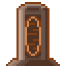

# clockxie
A clock, alarm and countdown timer made in Godot

Why?
-
While I was debloating Windows I deleted also the clock app. I soon recovered it, but in the meantime I tried developing something similar to improve my skills in Godot and GDScript.

How it works?
-
It's all pretty rough but straightforward. If you have any kind of problem or suggestion feel free to open an issue.

What's next?
-
- Feel free to propose something!

## Credits:
Thanks Lorenzo for the countdown system

Made with Godot Engine

Font: Roboto
Designed by Christian Robertson
(https://fonts.google.com/specimen/Roboto)
